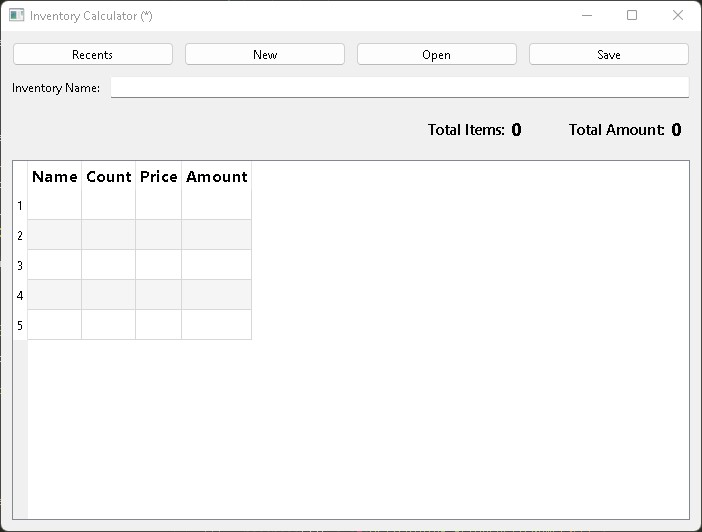

# inventory_calculator

A PySide6 powered inventory calculator.

## Inventory Actions

- New Inventory
- Open Inventory
- Save Inventory
- Edit Inventory Name

## Item Actions

- Add item
- Insert item
- Remove item
- Move item

## Inventory Schema

- file extension: `.json`
- file format: `json`

  ```json
  {
    "name": "Inventory name",
    "items": [
      {
        "name": "Item name",
        "count": 5,
        "price": 50000,
        "comments": "Optional additional comments pertaining to this item"
      }
    ]
  }
  ```

_Placeholder for the ui image till when it has been developed_


In my plan for you this year.

- February

  - I will give you ₦ 400,000, to clear OSCOFED loan so that you can collect ₦ 1,300,000 in March

- March

  - You will pay Arowolo (₦ 700,000, remaining ₦ 800,000), Iyabo (₦ 200,000, remaining ₦ 100,000), and Honorable (₦ 400,000, remaining ₦ 400,000) altogether making ₦ 1,300,000

- April

  - You will by yourself make repayment of ₦ 130,000 to OSCOFED

- May

  - You will by yourself make repayment of ₦ 130,000 to OSCOFED

- June

  - You will by yourself make repayment of ₦ 130,000 to OSCOFED.
  - I will also help you to return Kenny's ₦ 700,000 to her, and also give you ₦ 600,000 to pay Arowolo (₦ 500,000) and Iyabo (₦ 100,000), altogether making another ₦ 1,300,000.
  - The ₦ 700,000 I help you to pay Kenny, you will use it to pay the remaining of Arowolo (₦ 300,000) and Honorable (₦ 400,000)

- July

  - I will send you ₦ 120,000 for repayment of OSCOFED ₦ 1,300,000 loan, you will add ₦ 10,000 to it to make ₦ 130,000.

- August

  - I will send you ₦ 130,000 for repayment of OSCOFED ₦ 1,300,000 loan.

- September

  - I will send you ₦ 130,000 for repayment of OSCOFED ₦ 1,300,000 loan.

- October

  - I will send you ₦ 130,000 for repayment of OSCOFED ₦ 1,300,000 loan.

- November

  - I will send you ₦ 130,000 for repayment of OSCOFED ₦ 1,300,000 loan.

- December

  - I will send you ₦ 260,000 to clear out OSCOFED ₦ 1,300,000 loan.
