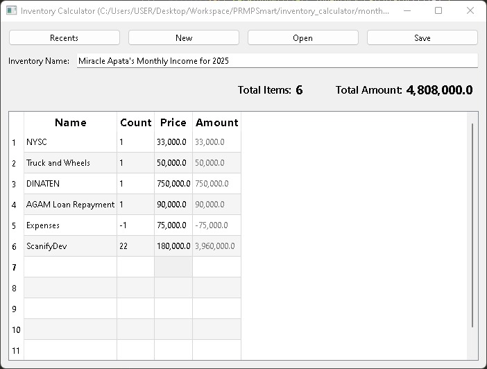

# inventory_calculator

A PySide6 powered inventory calculator.

## Inventory Actions

- New Inventory
- Open Inventory
- Save Inventory
- Edit Inventory Name

## Item Actions

- Add item
- Insert item
- Remove item
- Move item

## Inventory Schema

- file extension: `.json`
- file format: `json`

  ```json
  {
    "name": "Inventory name",
    "items": [
      {
        "name": "Item name",
        "count": 5,
        "price": 50000,
        "comments": "Optional additional comments pertaining to this item"
      }
    ]
  }
  ```

_Placeholder for the ui image till when it has been developed_

